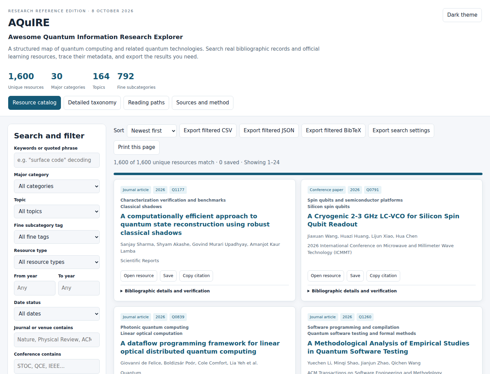

# AQuIRE

**Awesome Quantum Information Research Explorer**

Pronounced “acquire.”

A searchable reference library for quantum computing and related quantum technologies, combining a detailed subject taxonomy, scholarly bibliography, official learning resources, and guided reading paths.

**1,600 resources · 30 major categories · 164 topics · 792 fine subcategory entries**

**Reference edition: 8 October 2026 · Project version 1.0.3**

The atlas connects algorithms, hardware, fault tolerance, software, and applications in a single offline explorer. Each resource has a stable identifier, a subject assignment, bibliographic metadata, and a link to its source record. Researchers can build focused reading lists; educators and students can follow eight reading paths through the collection.

## Explore the collection

Download or clone the repository and open **[index.html](index.html)** in a modern browser. The explorer is self-contained; search and exports work offline. Internet access is needed to open external resources.

- Combine keyword and quoted-phrase search with category, topic, fine tag, year, resource type, journal or venue, conference, author, publisher, and verification filters.
- Include related topic assignments, focus on curated core resources, and save resources locally in your browser.
- Browse the complete taxonomy and eight reading paths, inspect source metadata, and copy citations.
- Export every filtered result as CSV, JSON, or BibTeX; export search settings separately.
- Switch between light and dark themes and use the explorer on desktop or mobile.

Words in the search box combine with AND. For example, `"surface code" decoding` requires both the phrase and the additional word. Filters also combine with AND. Printing covers the currently displayed page of resource cards; data exports include all matching records.

## Reference files

| Format | Contents |
| --- | --- |
| [Interactive HTML](index.html) | Offline search, taxonomy, reading paths, bookmarks, and filtered exports |
| [PDF](exports/AQuIRE.pdf) | 215-page reading edition with the full taxonomy and catalog |
| [Word](exports/AQuIRE.docx) | Editable reading edition |
| [Markdown](exports/AQuIRE.md) | Complete taxonomy, catalog, methods, and field definitions |
| [JSON](data/atlas.json) | Canonical taxonomy, records, reading paths, and methodology |
| [CSV](exports/resources.csv) | Flat bibliographic metadata |
| [BibTeX](exports/references.bib) | 1,600 references with stable citation keys |
| [Taxonomy guide](docs/TAXONOMY.md) | Category descriptions, topic definitions, and fine vocabulary |

## Subject coverage

The hierarchy spans mathematical foundations and entanglement; computational models and complexity; core and advanced algorithms; Hamiltonian simulation, chemistry, and materials; variational methods, machine learning, and optimization; superconducting, ion, neutral-atom, spin, and photonic hardware; control, noise, error correction, fault tolerance, mitigation, and benchmarks; programming, compilation, simulation, cloud systems, and architecture.

Quantum networking, cryptography, sensing, scientific applications, and research practice are included with their relationship to computation made explicit. Classical post-quantum cryptography and quantum sensing remain distinct from quantum computation. The hierarchy is a broad map of the field rather than an exhaustive or final classification.

The 792 count describes fine vocabulary entries within topic branches. It is not a count of unique terms across the entire hierarchy or a guarantee that every fine branch has a precisely tagged resource. All 164 topics have at least one primary resource in this edition.

## Sources and verification

The snapshot contains **1,546 DOI-bearing scholarly records retrieved from Crossref** and **54 retrieved first-party web resources**. Supplied publication years range from **1966 to 2026**. Undated resources remain undated.

| Verification label | Evidence |
| --- | --- |
| Registered DOI | A corresponding Crossref bibliographic record was retrieved. Individual DOI resolvers and full texts were not universally checked. |
| Page retrieved | The first-party page was retrieved successfully and had an identifiable, non-error title on the snapshot date. |

Titles and metadata support subject assignments; finer tags use conservative title evidence. `Topic level only` means a finer assignment was not established. Source metadata may contain omissions or errors. The collection is a bibliography, not a full-text systematic review, a peer-review guarantee, or a ranking of scientific quality. Retractions and corrections were not comprehensively screened across external databases.

See [methodology](docs/METHODOLOGY.md), [data fields](docs/DATA_DICTIONARY.md), and [third-party notices](THIRD_PARTY_NOTICES.md) for provenance, interpretation, and rights.

## Contributing

Corrections, well-supported resource additions, taxonomy refinements, and usability improvements are welcome. Provide a DOI or first-party source URL and evidence for the proposed subject assignment. Keep existing resource identifiers stable and preserve missing dates rather than estimating them. Read [CONTRIBUTING.md](CONTRIBUTING.md) before opening a pull request.

## Citation and license

Cite the atlas as *AQuIRE: Awesome Quantum Information Research Explorer*, version 1.0.3, reference edition 8 October 2026. Machine-readable project citation metadata is supplied in [CITATION.cff](CITATION.cff). Cite individual publications separately using their source metadata or exported references.

Original project code and original documentation are available under the [MIT License](LICENSE). Linked papers, books, courses, software projects, and publisher material retain their respective rights. Inclusion in the catalog does not relicense those works; see [THIRD_PARTY_NOTICES.md](THIRD_PARTY_NOTICES.md).

## Acknowledgments

**OpenAI 6.1 sol was used to obtain and organize the initial resource collection and to assist with taxonomy development, documentation, and repository preparation.** Bibliographic identity is supported by the retrieved source records; AI assistance does not imply publisher endorsement or universal full-text verification.

The project acknowledges Crossref, the authors and publishers of the indexed literature, and the institutions and open-source maintainers providing the linked educational and technical resources.

## Privacy and security

The release uses an explicit file allowlist and excludes Git history, credentials, local environments, caches, saved browser state, and private runtime metadata. Public catalog data and original project files are included. Search runs locally; the browser policy blocks outbound app connections and unapproved scripts. See [SECURITY.md](SECURITY.md) for the security model and limits of these checks. Public GitHub repositories and public GitHub Pages sites remain readable and indexable; this distribution provides no access control or confidential storage.
